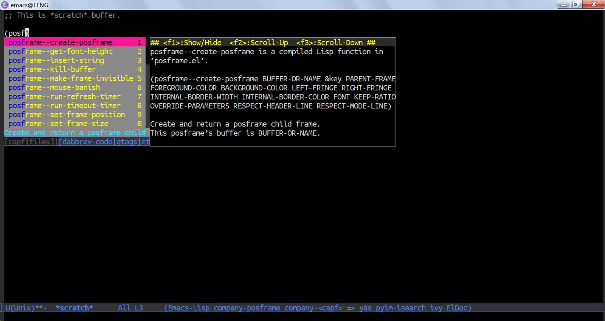

Note: this file is auto converted from company-posframe.el by [el2org](https://github.com/tumashu/el2org), please do not edit it by hand!!!

# &#30446;&#24405;

1.  [company-posframe README](#orgd5c8bdb)
    1.  [What is company-posframe](#org05cffac)
    2.  [How to use company-posframe](#org001c596)
    3.  [Tips](#org77c9718)
        1.  [Work better with desktop.el](#org420692d)
    4.  [Note](#org56fb8d3)

# company-posframe README

## What is company-posframe

company-posframe is a company extension, which let company use
child frame as its candidate menu.

It has the following feature:

1.  It is fast enough for daily use.
2.  It works well with CJK language.

## How to use company-posframe

    (require 'company-posframe)
    (company-posframe-mode 1)

## Tips

### Work better with desktop.el

The below code let desktop.el not record the company-posframe-mode

    (require 'desktop) ;this line is needed.
    (push '(company-posframe-mode . nil)
          desktop-minor-mode-table)

## Note

company-posframe.el is derived from Clément Pit-Claudel's
company-tooltip.el, which can be found at:

<https://github.com/company-mode/company-mode/issues/745#issuecomment-357138511>

Some quickhelp functions is come from:

[company-quickhelp](https://github.com/company-mode/company-quickhelp)

